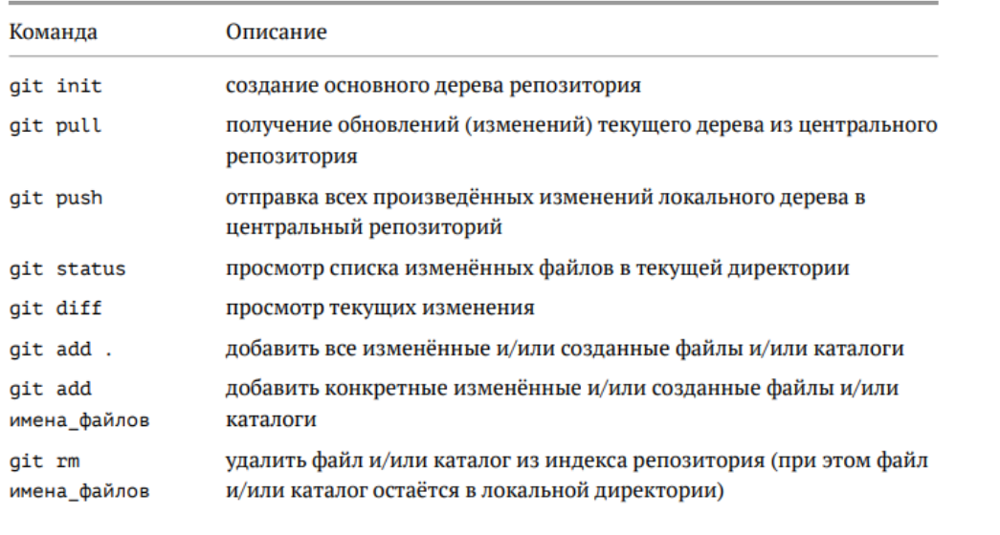
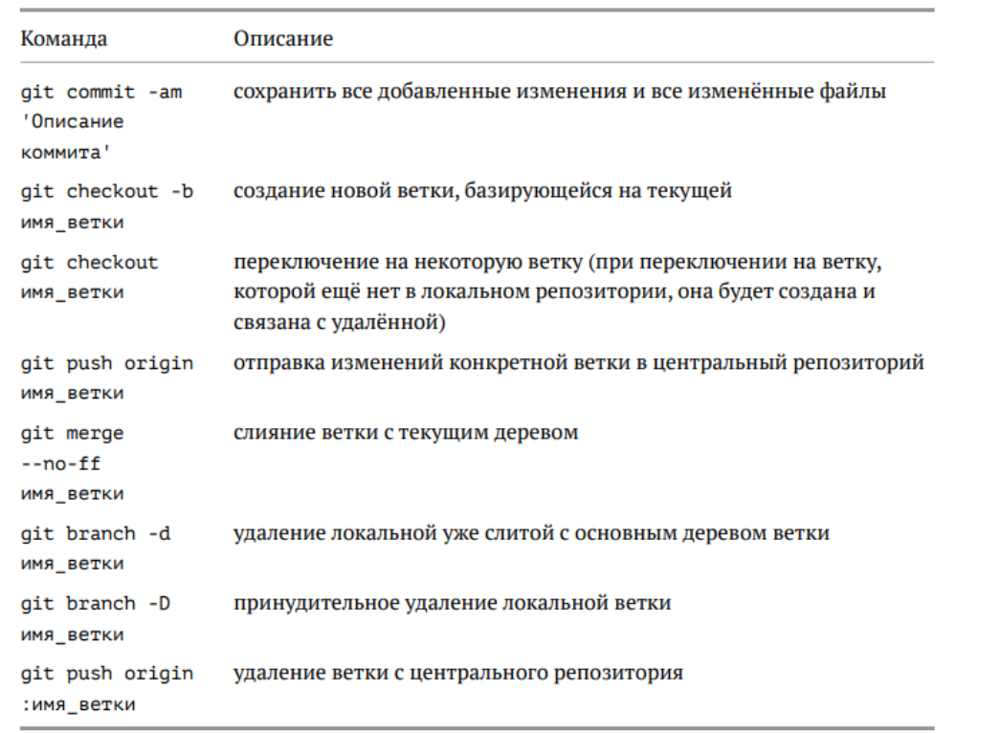
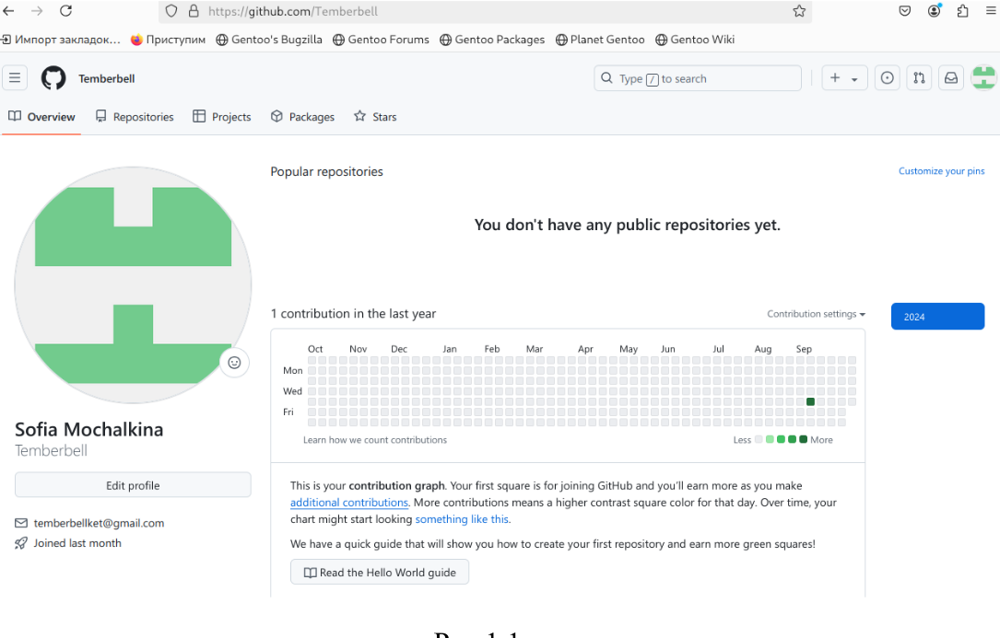
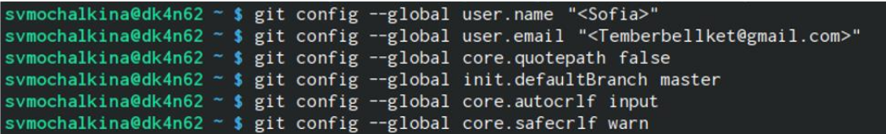
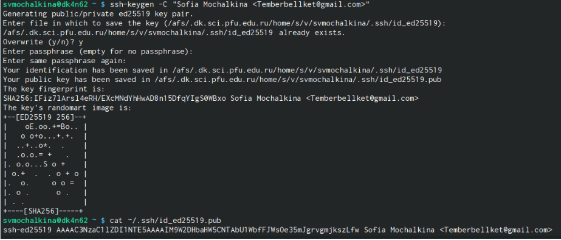
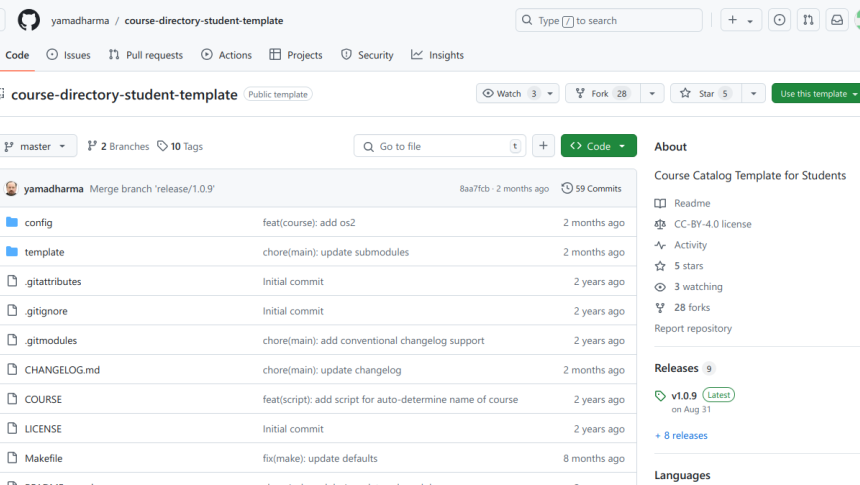
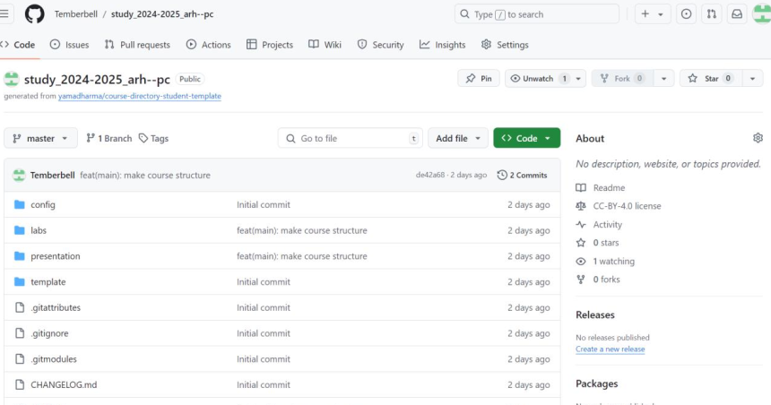
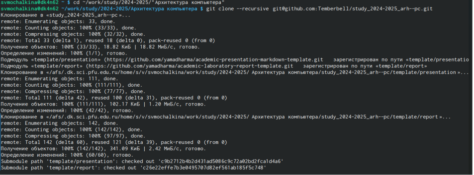
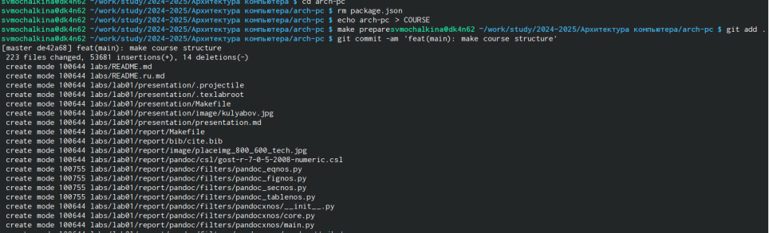
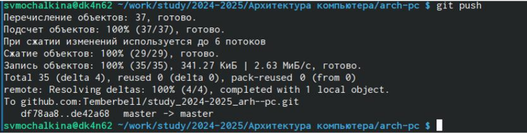

---
## Front matter
title: "Лабораторная работа №2"
subtitle: "Система контроля
версий Git"
author: "Мочалкина Софья Васильевна"

## Generic otions
lang: ru-RU
toc-title: "Содержание"

## Bibliography
bibliography: bib/cite.bib
csl: pandoc/csl/gost-r-7-0-5-2008-numeric.csl

## Pdf output format
toc: true # Table of contents
toc-depth: 2
lof: true # List of figures
lot: true # List of tables
fontsize: 12pt
linestretch: 1.5
papersize: a4
documentclass: scrreprt
## I18n polyglossia
polyglossia-lang:
  name: russian
  options:
	- spelling=modern
	- babelshorthands=true
polyglossia-otherlangs:
  name: english
## I18n babel
babel-lang: russian
babel-otherlangs: english
## Fonts
mainfont: IBM Plex Serif
romanfont: IBM Plex Serif
sansfont: IBM Plex Sans
monofont: IBM Plex Mono
mathfont: STIX Two Math
mainfontoptions: Ligatures=Common,Ligatures=TeX,Scale=0.94
romanfontoptions: Ligatures=Common,Ligatures=TeX,Scale=0.94
sansfontoptions: Ligatures=Common,Ligatures=TeX,Scale=MatchLowercase,Scale=0.94
monofontoptions: Scale=MatchLowercase,Scale=0.94,FakeStretch=0.9
mathfontoptions:
## Biblatex
biblatex: true
biblio-style: "gost-numeric"
biblatexoptions:
  - parentracker=true
  - backend=biber
  - hyperref=auto
  - language=auto
  - autolang=other*
  - citestyle=gost-numeric
## Pandoc-crossref LaTeX customization
figureTitle: "Рис."
tableTitle: "Таблица"
listingTitle: "Листинг"
lofTitle: "Список иллюстраций"
lotTitle: "Список таблиц"
lolTitle: "Листинги"
## Misc options
indent: true
header-includes:
  - \usepackage{indentfirst}
  - \usepackage{float} # keep figures where there are in the text
  - \floatplacement{figure}{H} # keep figures where there are in the text
---

# Цель работы

Целью работы является изучить идеологию и применение средств контроля
версий. Приобрести практические навыки по работе с системой git.

# Задание

1. Настроить GitHub.
2. Создать SSH ключи.
3. Создать рабочее пространство и репозиторий курса на основе шаблона.
4. Настроить каталог курса.
5. Выполнить задания для самостоятельной работы.

# Теоретическое введение

{#fig:001 width=100%}
{#fig:001 width=100%}

# Выполнение лабораторной работы

2.4.1. Настройка github
Требуется создать учетную запись на сайте github. (рис.1.1)
{#fig:001 width=100%}

2.4.2. Базовая настройка git
Сделаем предварительную конфигурацию git. В терминале введём следующие
команды (рис. 2.1):
{#fig:001 width=100%}
2.4.3. Создание SSH ключа
1.\ Сгенерируем пару ключей для последующей идентификации пользователя
на сервере репозиториев. (рис.3.1)
2.\ Загрузим сгенерированный открытый ключ. Для этого зайдём на сайт http:
//github.org/ и перейдём в меню Setting. После этого нужно выбрать в боковом
меню SSH and GPG keys и нажать кнопку New SSH key. Скопировав из
локальной консоли ключ в буфер обмена.
3.\ Вставляем ключ в появившееся на сайте поле и указываем для ключа имя
(Title).
{#fig:001 width=100%}

2.4.4. Создание рабочего пространства и репозитория курса на основе шаблона Откроем
терминал и создадим каталог для предмета «Архитектура компьютера» с помощью
команды mkdir. (рис.4.1)
{#fig:001 width=100%}

2.4.5. Создание репозитория курса на основе шаблона
1.\ Перейдём на станицу репозитория с шаблоном курса
https://github.com/yamadharma/cour se-directory-student-template. Выберем Use
this template.
2.\ В открывшемся окне зададим имя репозитория study_2024–2025_arhpc и
создадим репозиторий.
3.\ В терминале перейдём в каталог курса и клонируем созданный репозиторий.

{#fig:001 width=100%}
{#fig:001 width=100%}
{#fig:001 width=100%}

2.4.6 Настройка каталога курса
1.\ Перейдем в каталог курса и удалим лишние файлы. (рис.5.4)
2.\ Создадим необходимые каталоги. (рис.5.4)
3.\ Отправим файлы на сервер. (рис.5.5)

{#fig:001 width=100%}
{#fig:001 width=100%}

10
2.5 Задание для самостоятельной работы
1.\ Создать отчет по выполнению лабораторной работы в каталоге рабочего
пространства (labs>lab02>report).
2.\ Скопировать отчеты по выполнению предыдущих лабораторных работ в
соответствующие каталоги созданного рабочего пространства.
3.\ Загрузить файлы на github.
# Выводы

Изучила идеологию и применила средства контроля версий. Приобрела
практические навыки по работе с системой git и выполнила задания в соответствии с
указаниями лабораторной работы.

# Список литературы{.unnumbered}
1. GDB: The GNU Project Debugger. — URL: https://www.gnu.org/software/gdb/.
2. GNU Bash Manual. — 2016. — URL: https://www.gnu.org/software/bash/manual/.
3. Midnight Commander Development Center. — 2021. — URL: https://midnight-
commander. org/.
4. NASM Assembly Language Tutorials. — 2021. — URL: https://asmtutor.com/.
5. Newham C. Learning the bash Shell: Unix Shell Programming. — O’Reilly Media, 2005.
— 354 с. — (In a Nutshell). — ISBN 0596009658. — URL:
http://www.amazon.com/Learningbash-Shell-Programming-Nutshell/dp/0596009658.
6. Robbins A. Bash Pocket Reference. — O’Reilly Media, 2016. — 156 с. — ISBN 978-
1491941591.
7. The NASM documentation. — 2021. — URL: https://www.nasm.us/docs.php.
8. Zarrelli G. Mastering Bash. — Packt Publishing, 2017. — 502 с. — ISBN 9781784396879.
9. Колдаев В. Д., Лупин С. А. Архитектура ЭВМ. — М. : Форум, 2018.
10. Куляс О. Л., Никитин К. А. Курс программирования на ASSEMBLER. — М. :
Солон-Пресс, 2017.
11. Новожилов О. П. Архитектура ЭВМ и систем. — М. : Юрайт, 2016.
12. Расширенный ассемблер: NASM. — 2021. — URL:
https://www.opennet.ru/docs/RUS/nasm/.
13. Робачевский А., Немнюгин С., Стесик О. Операционная система UNIX. — 2-е изд.
— БХВПетербург, 2010. — 656 с. — ISBN 978-5-94157-538-1.
14. Столяров А. Программирование на языке ассемблера NASM для ОС Unix. — 2-е
изд. — М. : МАКС Пресс, 2011. — URL: http://www.stolyarov.info/books/asm_unix.
15. Таненбаум Э. Архитектура компьютера. — 6-е изд. — СПб. : Питер, 2013. — 874 с.
— (Классика Computer Science).
16. Таненбаум Э., Бос Х. Современные операционные системы. — 4-е изд. — СПб. :
Питер, 2015. — 1120 с. — (Классика Computer Science).

